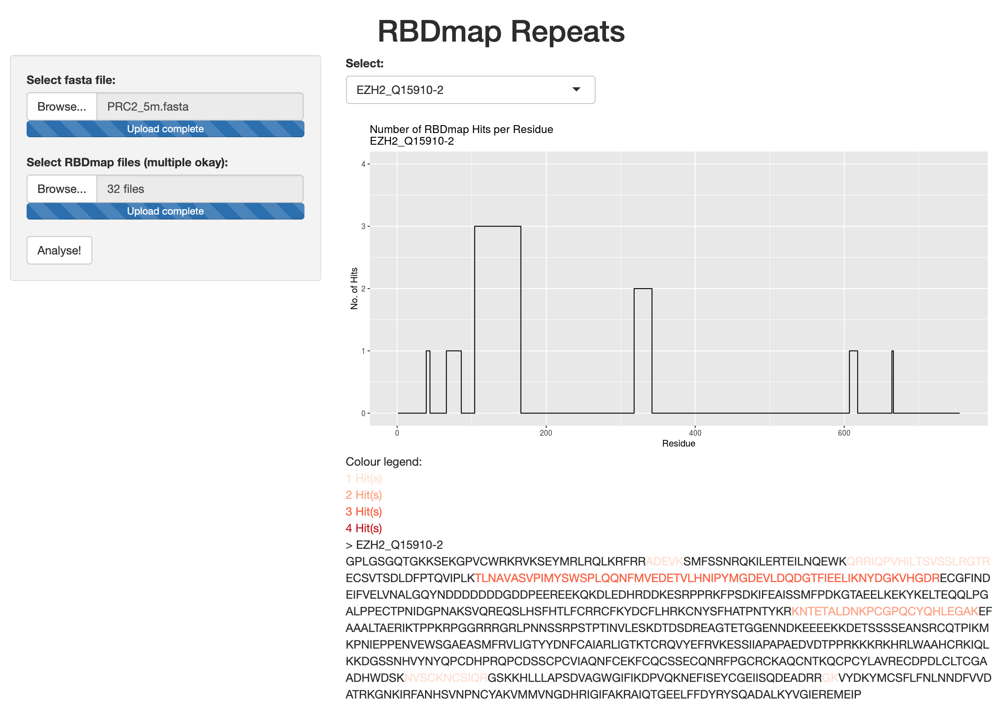

# RBDmap Lite

## An R Shiny app for detecting RNA-binding sites within proteins

RBDmap Lite is an R Shiny app used to identify RNA-binding sites within proteins from LC-MS/MS data after performing cross-linking with mass spectrometry (XL-MS) using the RBDmap method. For more information about the RBDmap workflow and how it was previously used to directly identify an RNA-binding binding site in an unbiased manner within the PRC2 protein complex, please see the references at the bottom [1, 2].

A live version of RBDmap Lite can be accessed here:
[https://n-j-mckenzie.shinyapps.io/RBDmap_Lite/](https://n-j-mckenzie.shinyapps.io/RBDmap_Lite/)

### Necessary input files:
* A .fasta file of your protein or protein complex of interest (included example: "prc2_5m.fasta")
* .txt files contained tab-separated data generated from analysing raw LC-MS/MS output files using MaxQuant (included example files in "LS-MSMS-data" directory). Files must have the following keywords in the file name: "UV", "ArgC" or "LysC", and a digit based on the repeat number (e.g. "Repeat01_UV_ArgC_Eluate.txt")

### Output generated:
* A graph (or graphs if a protein complex) based on the number of hits per repeat of RBDmap. Each individual subunit within a protein complex can be selected via a drop-down menu.
* A colour-coded sequence of the protein of interest, where the number of hits of residues identified to bind RNA are colour-coded.

### Test it out using a real example:
1. Launch the live version of the app by [clicking here](https://n-j-mckenzie.shinyapps.io/RBDmap_Lite/).
1. Under "Select fasta file:", upload the "prc2_5m.fasta" file.
1. Under "Select RBDmap files", select all of the .txt files contained within the "LS-MSMS-data" directory (using Shift+Click or Shift/Cmd+A).
1. Click "Analyse!" and wait approx. 5 seconds for the analysis to occur.
1. A graph with residue numbers on the x-axis and number of hits on the y-axis should appear. If using a multi-protein complex (such as PRC2), you can select each inddividual subunit from the drop-down menu under "Select:".
1. You can save the images by right-clicking on the image and clicking "Save As...". Coloured text corresponding to number of hits per residue can be copy-pasted into a software such as Microsoft Word that supports Rich Text with the colour-coding intact.

Functionally, RBDmap Lite is much more simple and humble version of the crisscrosslinkeR R package by [egmg726](https://github.com/egmg726/crisscrosslinker) [2]. If you're interested in analysing RNA-protein and protein-protein interactions, it would be good to look into that package. RBDmap Lite will look at RNA-protein binding interactions only and also doesn't automatically generate PyMOL files with residues coloured in as with crisscrosslinkeR. However, RBDmap Lite does provide a very user-friendly UI in the form of an online app, as well as a coloured version of the protein sequence with residue letters.

### References:
1. Zhang, Q., McKenzie, N.J., Warneford-Thomson, R., Gail, E.H., Flanigan, S.F., Owen, B.M., Lauman, R., Levina, V., Garcia, B.A., Schittenhelm, R.B. and Bonasio, R., 2019. RNA exploits an exposed regulatory site to inhibit the enzymatic activity of PRC2. Nature structural & molecular biology, 26(3), pp.237-247.
1. Gail, E.H., Shah, A.D., Schittenhelm, R.B. and Davidovich, C., 2020. crisscrosslinkeR: identification and visualization of protein–RNA and protein–protein interactions from crosslinking mass spectrometry. Bioinformatics.